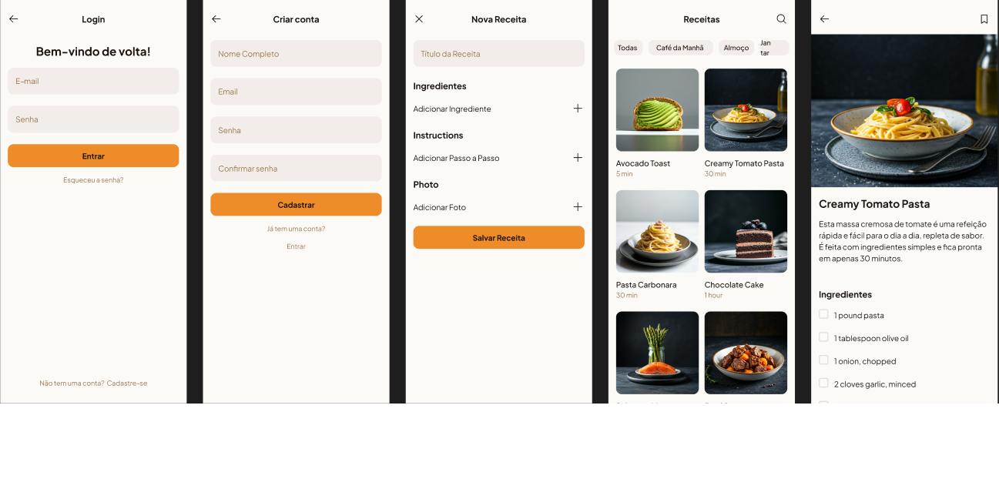

# Receitas Dona Benta Refatorado


Um aplicativo mobile de receitas culinárias, inspirado nas clássicas e queridas receitas da Dona Benta, com uma interface moderna e funcionalidades aprimoradas para o usuário. Este projeto visa refatorar uma base de código existente, aplicando princípios de Clean Code, modularização e boas práticas de desenvolvimento.

## Projeto original

https://github.com/julianocfelipe/ReceitasDonaBenta/tree/main

## 🚀 Funcionalidades

Este aplicativo oferece as seguintes funcionalidades principais:

- **Autenticação de Usuário:** Login e talvez cadastro de novos usuários. (Conforme visto a pasta `screens/Login`)
- **Listagem de Receitas:** Navegação por uma biblioteca de receitas.
- **Visualização Detalhada da Receita:** Instruções passo a passo, ingredientes, tempo de preparo, etc.
- **Busca e Filtragem:** Encontre receitas específicas por nome, ingrediente ou categoria.
- **Favoritar Receitas:** Salve suas receitas preferidas para acesso rápido.
- **Modo de Preparo Interativo:** (Opcional, mas um bom futuro recurso) Guia o usuário durante o preparo.

## 🛠️ Tecnologias Utilizadas

- **Frontend:** React Native
- **Linguagem:** TypeScript
- **Gerenciamento de Pacotes:** npm
- **Estado:** (Ex: Redux, Zustand, Context API)
- **Navegação:** (Ex: React Navigation)
- **Estilização:** (Ex: Styled Components, NativeBase, StyleSheet API)
- **Testes:** (Ex: Jest, React Testing Library) - _Este é um ponto a ser implementado._
- **Linter/Formatador:** (Ex: ESLint, Prettier) - _Este é um ponto a ser implementado._

## 📱 Telas




## ⚙️ Instalação

Para configurar e rodar o projeto localmente, siga os passos abaixo:

### Pré-requisitos

Certifique-se de ter as seguintes ferramentas instaladas em sua máquina:

- Node.js (versão LTS recomendada)
- Yarn ou npm
- Expo CLI (se estiver usando Expo) ou React Native CLI (se estiver usando bare React Native)

### Passos

1.  **Clone o repositório:**

    ```bash
    git clone [https://github.com/julianocfelipe/ReceitasDonaBentaRefatorado.git](https://github.com/julianocfelipe/ReceitasDonaBentaRefatorado.git)
    cd ReceitasDonaBentaRefatorado
    ```

2.  **Instale as dependências:**

    ```bash
    yarn install
    # ou
    npm install
    ```

3.  **Execute o aplicativo:**

    - **Para Android:**
      ```bash
      yarn android
      # ou
      npm run android
      ```
    - **Para iOS:** (Necessário ter um ambiente macOS)
      ```bash
      yarn ios
      # ou
      npm run ios
      ```
    - **Via Expo (se aplicável):**
      ```bash
      yarn start
      # ou
      npm start
      ```
      Em seguida, escaneie o QR code com seu dispositivo ou use um emulador/simulador.

## 🚀 Como Contribuir

Agradecemos o interesse em contribuir! Siga estas diretrizes:

1.  Faça um fork do repositório.
2.  Crie uma nova branch para sua feature (`git checkout -b feature/minha-nova-feature`).
3.  Faça suas alterações e commit (`git commit -m 'feat: adiciona nova feature X'`).
4.  Envie para o branch original (`git push origin feature/minha-nova-feature`).
5.  Abra um Pull Request, descrevendo suas alterações.

## 📞 Contato

Se tiver alguma dúvida ou sugestão, entre em contato:

- **Juliano Cardoso Felipe** - `jcfjulianojcf@gmail.com`
- GitHub: [julianocfelipe](https://github.com/julianocfelipe)
